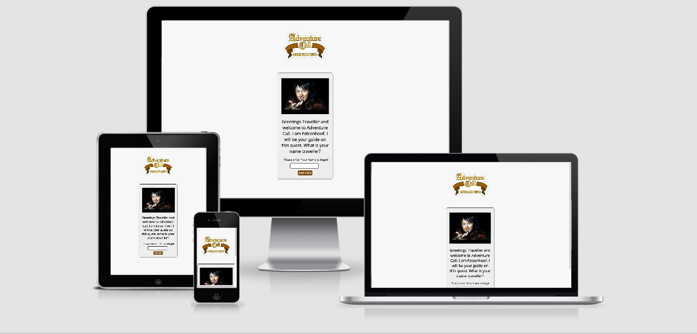

<h1>Adventure Call</h1>

Greetings traveller!

This is a text adventure game similar to Dungeons and Dragons based on scottish tv comedy program maker Limmy's 'Adventure Call' sketch series.  The game can
bring up different answer options based on what items you have picked up.  Can you make it all the way to the end for a special treat?

To go to the live site click [here](https://markj0hnst0n.github.io/AdventureCall/)

# UX

## User Stories

- As a user/player of the game I want to have a fun experience with some pay off at the end.
- As a user/player of the game I want some kind of personalisation of my experience so that I can feel more connected to what is going on.
- As a fan of fantasy/role playing games I want references to the tropes associated with these games.
- As a fan of the original limmy sketch I want to have references to the show so that it will make the game more fun.

See separate Testing.md file for information on how these user stories were tested [here](testing/testing.md)

## Wireframes

Basic wireframes for this project were created using Balsamiq and you can find a link to the balsamiq project file [here](!)

[Wireframes Pictures Repository](https://github.com/markj0hnst0n/AdventureCall/tree/master/wireframes)

## Colour Scheme

The colour scheme of brown/grey/gold/black used was based on the Adventure Call logo from Limmy's show.  This was used as the logo for the screen and the colours on the screen where influenced
by this.  [Coolors](https://coolors.co/) was used to find the exact matches.  The brown colour was amended slightly for the buttons to be darkerthan the logo brown and thus create higher contrast.
This action created a higher contrast between foreground and background colours to improve accessability from vision impaired users.

The container for the questions was made a slightly darker grey to match the skull used for the death screens.

### Features

#### Welcome Screen

- User is welcomed by Falconhoof.  A familiar character for fans of the show.

#### Name input box

- allows all users to enter their name and returns an error message if no name is entered

#### The game itself

- Brings up questions and answers for the player based on what items the player is holding.  Players answer questions in the hope fo making it to the end of the game without dying.

#### End Screen

- A final screen with a personalised greeting and an animated treat for any users making it to the end.  This screen gives the option to start all over again from the very beginnning.

## Features left to impliment

# Technologies Used

[HTML5](https://en.wikipedia.org/wiki/HTML5)
for the structure of the website

[CSS 3](https://en.wikipedia.org/wiki/Cascading_Style_Sheets#CSS_3)
for the look of the website

[Javascript](https://en.wikipedia.org/wiki/JavaScript)
for the logic of the game.  To manipulate the HTML and CSS on the screen.

[jQuery](https://en.wikipedia.org/wiki/JQuery)
To manipulate the HTML and CSS on the screen.

[JShint](https://jshint.com/)
To validate javscript code.

[Coolors](https://coolors.co/)
For help with colours and colours scheme.

[PicResize](https://picresize.com/)
For image formatting.

[Webformatter](https://webformatter.com/)
For formatting code.

[Asana](https://asana.com/)
for project management

[Balsamiq Wireframes](https://balsamiq.com/wireframes/)
for creating Wireframes for initial visual development

[Gitpod](https://www.gitpod.io/) for writing and testing code.

[GitHub](https://github.com/) for storing code.

[Google Chrome Development Tools](https://developers.google.com/web/tools/chrome-devtools) for testing code on various device sizes during development.

[Web Formatter](https://webformatter.com/) to format HTML and CSS code.

[Troy](http://troy.labs.daum.net/) to test website on different device types and sizes

[Google Lighthouse](https://developers.google.com/web/tools/lighthouse) for testing code health, accessibility, speed and search engine optimisation

# Testing

See separate Testing.md file [here](testing/testing.md)

# Deployment

## Using Github Pages

In the GitHub Repository from the project (https://github.com/markj0hnst0n/AdventureCall)

1. Click the 'Settings' Tab.
2. Scroll Down to the Git Hub Pages Heading.
3. Select 'Master Branch' as the source.
4. The Page will reload 'Settings' again.
5. Scroll to GitHub pages heading and there will now be a clickable link (!)
6. Click this link for the live deployed page

## Run Locally

In the GitHub Repository from the project (https://github.com/markj0hnst0n/AdventureCall)

1. Click Clone or Download
2. Copy Git URL from the dialogue box
3. Open your developement editor of choice and open a terminal window in a directory of your choice
4. Use the 'git clone' command in terminal followed by the copied git URL
5. A clone of the project will be created locally on your machine

# Credits

## Content

Written content by Mark Johnston

## Media

https://www.animatedimages.org/data/media/492/animated-fireworks-image-0014.gif

## Influences

The inspiration behind the code of the game is from this youtube video

https://www.youtube.com/watch?v=R1S_NhKkvGA

Debugging vid.

https://www.youtube.com/watch?v=AX7uybwukkk

Node in the DOM

https://www.w3schools.com/js/js_htmldom_nodes.asp#:~:text=To%20add%20a%20new%20element,it%20to%20an%20existing%20element.

Value from textbox input

https://www.tutorialrepublic.com/faq/how-to-get-the-value-in-an-input-text-box-using-jquery.php

How to center an absolute element

https://stackoverflow.com/questions/8508275/how-to-center-a-position-absolute-element

Hover Effect

https://ianlunn.github.io/Hover/

let, var, const usage

https://www.youtube.com/watch?v=sjyJBL5fkp8&amp;t=10s

Adding Event listener for enter key in jQuery

https://stackoverflow.com/questions/979662/how-to-detect-pressing-enter-on-keyboard-using-jquery

Timer js

https://stackoverflow.com/questions/29971898/how-to-create-an-accurate-timer-in-javascript

## Acknowledgements

Thanks to the following people for making the project happen:

- My Mentor Antonija Šimić
- The [Code Institute](https://codeinstitute.net/) Slack Community specifically SamFixG, Lucyjpjones and Sean Mc for testing the site.
- The [Code Institute](https://codeinstitute.net/) tutors and instructional material.  Tutor Stephen for his pep talk. Tutor Miklos for his perserverance.  Tutor Xavier for his excellent resources.
- My Wife Joanna Johnston for her (constructive) criticism and understanding when I lock myself away in the attic for hours on end