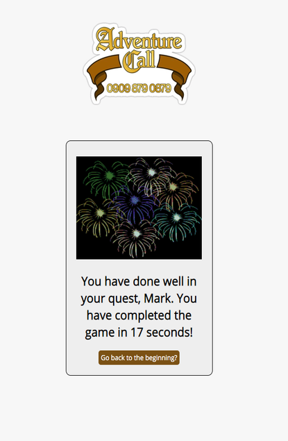

<h1>Adventure Call</h1>

Greetings traveller!

This is a text adventure game similar to Dungeons and Dragons based on scottish tv comedy program maker Limmy's 'Adventure Call' sketch series.  The game can
bring up different answer options based on what items you have picked up.  Can you make it all the way to the end for a special treat?

To go to the live site click [here](https://markj0hnst0n.github.io/AdventureCall/)

# UX

## User Stories

- As a user/player of the game I want to have a fun experience with some pay off at the end.
- As a user/player of the game I want some kind of personalisation of my experience so that I can feel more connected to what is going on.
- As a fan of fantasy/role playing games I want references to the tropes associated with these games.
- As a fan of the original limmy sketch I want to have references to the show so that it will make the game more fun.

See separate Testing.md file for information on how these user stories were tested [here](testing/testing.md)

## Wireframes

Basic wireframes for this project were created using Balsamiq and you can find a link to the balsamiq project file [here](!)

[Wireframes Pictures Repository](https://github.com/markj0hnst0n/AdventureCall/tree/master/wireframes)

## Colour Scheme

The colour scheme of brown/grey/gold/black used was based on the Adventure Call logo from Limmy's show.  This was used as the logo for the screen and the colours on the screen where influenced
by this.  [Coolors](https://coolors.co/) was used to find the exact matches.  The brown colour was amended slightly for the buttons to be darkerthan the logo brown and thus create higher contrast.
This action created a higher contrast between foreground and background colours to improve accessability from vision impaired users.

The container for the questions was made a slightly darker grey to match the skull used for the death screens.

### Features

#### Welcome Screen

- User is welcomed by Falconhoof.  A familiar character for fans of the show.

#### Name input box

- allows all users to enter their name and returns an error message if no name is entered

#### The game itself

- Brings up questions and answers for the player based on what items the player is holding and shows how long the game has taken so far in real time.  Players answer questions in the hope fo making it to the end of the game without dying.

#### End Screen

- A final screen with a personalised greeting and an animated treat for any users making it to the end including the time it's taken to complete the game.  This screen gives the option to start all over again from the very beginnning.

#### Timer

- A timer which counts up how long the player has been playing for and displayed the time taken if the player completes the game.

## Features left to impliment

# Technologies Used

[HTML5](https://en.wikipedia.org/wiki/HTML5)
for the structure of the website

[CSS 3](https://en.wikipedia.org/wiki/Cascading_Style_Sheets#CSS_3)
for the look of the website

[Javascript](https://en.wikipedia.org/wiki/JavaScript)
for the logic of the game.  To manipulate the HTML and CSS on the screen.

[jQuery](https://en.wikipedia.org/wiki/JQuery)
To manipulate the HTML and CSS on the screen.

[JShint](https://jshint.com/)
To validate javscript code.

[Coolors](https://coolors.co/)
For help with colours and colours scheme.

[PicResize](https://picresize.com/)
For image formatting.

[Webformatter](https://webformatter.com/)
For formatting code.

[Asana](https://asana.com/)
for project management

[Balsamiq Wireframes](https://balsamiq.com/wireframes/)
for creating Wireframes for initial visual development

[Gitpod](https://www.gitpod.io/) for writing and testing code.

[GitHub](https://github.com/) for storing code.

[Google Fonts](https://fonts.google.com/) for fonts used in the project.

[Google Chrome Development Tools](https://developers.google.com/web/tools/chrome-devtools) for testing code on various device sizes during development.

[Web Formatter](https://webformatter.com/) to format HTML and CSS code.

[Troy](http://troy.labs.daum.net/) to test website on different device types and sizes

[Google Lighthouse](https://developers.google.com/web/tools/lighthouse) for testing code health, accessibility, speed and search engine optimisation

# Testing

See separate Testing.md file [here](testing/testing.md)

# Deployment

## Using Github Pages

In the GitHub Repository from the project (https://github.com/markj0hnst0n/AdventureCall)

1. Click the 'Settings' Tab.
2. Scroll Down to the Git Hub Pages Heading.
3. Select 'Master Branch' as the source.
4. The Page will reload 'Settings' again.
5. Scroll to GitHub pages heading and there will now be a clickable link (!)
6. Click this link for the live deployed page

## Run Locally

In the GitHub Repository from the project (https://github.com/markj0hnst0n/AdventureCall)

1. Click Clone or Download
2. Copy Git URL from the dialogue box
3. Open your developement editor of choice and open a terminal window in a directory of your choice
4. Use the 'git clone' command in terminal followed by the copied git URL
5. A clone of the project will be created locally on your machine

# Credits

## Content

Written content by Mark Johnston

## Media

https://www.animatedimages.org/data/media/492/animated-fireworks-image-0014.gif

## Influences

The inspiration behind the code of the game is from this youtube video

https://www.youtube.com/watch?v=R1S_NhKkvGA

Debugging vid.

https://www.youtube.com/watch?v=AX7uybwukkk

Node in the DOM

https://www.w3schools.com/js/js_htmldom_nodes.asp#:~:text=To%20add%20a%20new%20element,it%20to%20an%20existing%20element.

Value from textbox input

https://www.tutorialrepublic.com/faq/how-to-get-the-value-in-an-input-text-box-using-jquery.php

How to center an absolute element

https://stackoverflow.com/questions/8508275/how-to-center-a-position-absolute-element

Hover Effect

https://ianlunn.github.io/Hover/

let, var, const usage

https://www.youtube.com/watch?v=sjyJBL5fkp8&amp;t=10s

Adding Event listener for enter key in jQuery

https://stackoverflow.com/questions/979662/how-to-detect-pressing-enter-on-keyboard-using-jquery

Timer js

https://stackoverflow.com/questions/29971898/how-to-create-an-accurate-timer-in-javascript

## Acknowledgements

Thanks to the following people for making the project happen:

- My Mentor Antonija Šimić
- The [Code Institute](https://codeinstitute.net/) Slack Community specifically SamFixG, Lucyjpjones and Sean Mc for testing the site.
- The [Code Institute](https://codeinstitute.net/) tutors and instructional material.  Tutor Stephen for his pep talk. Tutor Miklos for his perserverance.  Tutor Xavier for his excellent resources.
- My Wife Joanna Johnston for her (constructive) criticism and understanding when I lock myself away in the attic for hours on end

# Testing

### On all Listed Devices the following tests were performed:

Initial testing was completed on a Macbook Pro running Chrome Browser and Samsung S10 phone.

### User Stories tests

- As a user/player of the game I want to have a fun experience with some pay off at the end.

This game has been tested on various users including friends and family members.  Most around 30-35 age group.
The users were familiar with the sketch show that the game is based on except for my wife but she enjoyed the
fantasy aspect of the game.  Users felt that there could have been more references to the show and there was
a suggestion that there could have been more interaction between the player and the guide character Falconhoof.
Overall the testers thought that the main objective of the first user story was met as the game was enjoyable to workout
and the little fireworks gif at the end provided a nice bookend to the experience.  The timer provides some impetus to the player
and creates some tension as well as giving them a 'score' to aim for after they have completed the game once. This provides
a more competitive experience as they try to beat their previous best time.

After the intial tests I found that it was a bit more intuitive to hit the enter key to start the initial game after typing in your name so
this funtionality was added into the game to improve user experience.

Below are some gameplay screenshots including the final fireworks sequence.

    

- As a user/player of the game I want some kind of personalisation of my experience so that I can feel more connected to what is going on.

The option of entering the player's name has been used to personalise the user experience so that the game can speak directly to the 
user.  This can be seen in the fireworks screenshot above and also the intial welcome screens of the game below.

 

- As a fan of fantasy/role playing games I want references to the tropes associated with these games.

Throughout the game reference is made to common stock characters and situations found within the fantasy/roleplaying genre.  Examples
include Trolls, wizards, golden amulets and castle towers!  This helps to create a familiar world for the user so that they can use their
imagination to immerse themselves in the game.  The pictures used further support this and they were chosen for their fun cartoonish
quality and as good representations of what the text is trying to convey.  This is demonstrated in the moonlit meadow picture above and the death screen shown below.

    

- As a fan of the original limmy sketch I want to have references to the show so that it will make the game more fun.

Users will find that all the situations that are presented from the games have a basis in the original sketches.  Specifically
the 'Christmas Special' sketch and the 'Greg' sketch.  Users found that the game was lacking in a lot of the humour from the sketches
and it was found to be a bit more serious.  Fans of the show would have preferred at least one sequence with Jingle the Jester of the
famous 'Kill Jester' sketch and as mentioned before more interaction with falconhoof would have improved the experience.  Overall
because of the many references to the show it is felt that the user story above has been achieved.

### Game Walkthrough

- Initial Welcome screen with Falconhoof character in reference to the inspiration sketch, text welcome and space for player to enter name.

- If player enters no name of a blank space they will be prompted to enter a name before continuing.

- Once player enters a valid name next screen is displayed with a personalised welcome for the player using their name.

- The game starts and the first question appears including any image associated with the question.  The buttons appear correctly.

- The player makes choices based on the answer options given and through the game is given the oppotunity to pick up objects which may help them later in the game.  On the screen where character is at the gate of bones when the character does not have the correct items the single button item is still off centre.  Could have written bespoke code to amend this but left is as is even though it jars slightly.  The correct options appear based on which item the player currently holds.

- If the player makes a choice which results in death then they are taken back to the first question without the personalised welcome show again.

- If the player makes all the correct choices and reaches the end of the game they are greeted with a personalised message and a gif of a fireworks display.

- At this stage they are given the chance to start from scratch by hitting the go back to the beginning button and reloading the page and the name is not held.

### Emulated Device Testing

The following devices were emulated on Google Chrome developer tools running the site and testing all the user stories and walkthrough steps with no issues:

Samsung Galaxy Fold
Motorola Moto G4
Microsoft Surface Duo

The Website was tested on the [Troy](http://troy.labs.daum.net/) site using the tests described above with no issues.

Emulated on Troy with all user stories and walkthrough steps tested with no issues:

Samsung Galaxy s8
Huawei Ascend Mate2
Sony Xperia Z
Google Nexus 5
HTC One
LG G5
Apple iPhone 6, 7 & 8
Apple iPhone 6s+, 7+ & 8+
LG G Pad 8.3
iPad retina
Samsung Galaxy Tab S
PC Screen 800px, 1024px, 1440px and 1920px.

Tested Lenovo a390 on Troy and due to small screen pixel width cut off sides of question container border but the questions were all still readable and all user stories still satisfied.

Larger screen widths above 1024px displayed a lot of white space either side of the game information but due to the mobile first nature of the design there were no additions made to change this.  All user stories still achieved.

link to Troy testing environment [HERE](http://troy.labs.daum.net/?url=https%3A%2F%2Fmarkj0hnst0n.github.io%2FAdventureCall%2F&device=N950;ASCENDMATE2;XPERIAZ;A390;HTCEVO;HTCONE;D821;A1474;PC03;T700;PC00;V500;SD820;PC07)

### Other Live Testing

It was tested live on iPhone 8 and the user found that they had to zoom in to read on question one.  No amendments made to ensure readability across all other screen sizes.

Unspecificed PC running Opera Browser reported that the main logo was slightly blurred.  This is a known issue as the image used was not of high resolution.  The logo was kept as it is perfect for the brief of representing the original sketch.

### Google Lighthouse testing documentation for desktop and mobile for all pages can be found in PDF form [here](!)

### W3C HTML and CSS validators – to test for any Errors in the code

### Screenshots of final w3c passes

- Homepage

- Dates page

- Audio Page

- Contact Page

- CSS information

### Debugging information

|   Bug	|  Fix	|
|-------|-------|
| Question not showing when using show question function in gameScript.js|  Variable declared incorrectly when checked on devtools so corrected.
| Next question not showing when option chosen | Checked syntax in dev tools and debugged syntax.  Some of the variables were not declared correctly.
| Name not showing in question when entered into textbox | Tried to declare playerName as a global variable but there was an issue with scope.  Used jquery 
| |to write a function within function and used variable locally within that function to add name to another 
| |element welcoming the player by name.
| Restart game message didn't appear when eastern passageway was chosen in question 2 | added noitems option for what character has
| Further issues with items still showing when game is restarted which brough up incorrect options | items variable reset in picked answer function if player goes back to the start
| Unclosed tag for div created issues with w3c validator. | Closed div tag
| Restart message appeared on question 5 even when player has correct item | removed add states except for those required.  Added extra steps so that next step gave restart option.
| Previous States showing when new game starts. | Console logged 'items' in pickedAnswer function to find scope and reset items to {} when player has to go back to the first question.
| Name check function form welcome screen wasn't working. | Re-wrote function.  suspect syntax error initally.
| When enter key is pressed on welcome screen the game doesn't move to the next screen | Added event lister for enter to run the function to move the game on to the next stage when enter is ----------
| When 1 option button is presented on screen from the answer options it does not show centrally | used javascript to remove the class causing this making sure it was reinstated at the start of the game again
| When player offered to help roofer they are supposed to die but this takes them to the end screen | had to add + 1 to questionNodes array length as the picked answer function was was triggering the end screen.